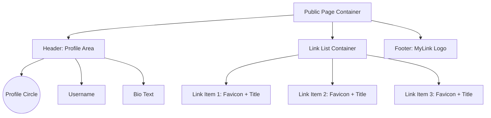
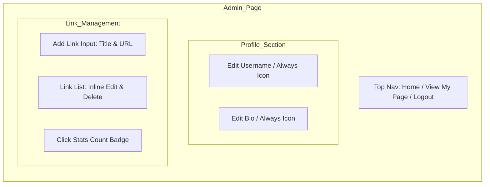

# 마이링크 (My Link) 와이어프레임

본 문서는 마이링크의 주요 페이지 레이아웃을 기술적인 시각화 도구(Mermaid, ASCII Art)를 통해 설명합니다.

---

## 1. 공개 랜딩 페이지 (Public View)
`mylink.io/{displayName}` 주소로 접속 시 노출되는 페이지입니다.

### 1.1 구조 다이어그램 (Mermaid)


### 1.2 시각적 레이아웃 (ASCII Style)
```text
_________________________________________
|                                       |
|               (  IMG  )               |
|               Username                |
|           "Short bio here..."         |
|_______________________________________|
|                                       |
|  [ (F)  Blog Link Title             ] |
|  [ (F)  GitHub Link Title           ] |
|  [ (F)  YouTube Channel             ] |
|  [ (F)  Twitter / X                 ] |
|                                       |
|_______________________________________|
|               MyLink                  |
|_______________________________________|
```

---

## 2. 관리자 페이지 (Admin Management)
소유자가 정보를 편집하고 링크를 관리하는 화면입니다.

### 2.1 구조 다이어그램 (Mermaid)


### 2.2 시각적 레이아웃 (ASCII Style)
```text
[ MyLink Admin ]            [ (View My Page) ] [ (Logout) ]
-----------------------------------------------------------

  PROFILE EDIT (My Page)
  +-------------------------------------------------------+
  |  Name: [ 마크타이거 (📝) ]                             |
  |  ID  : [ mktiger   (📝) ]                             |
  |  Bio : [ 개발자의 링크 한줄.. (📝) ]                  |
  +-------------------------------------------------------+

  ADD NEW LINK
  +-------------------------+ +-------------+
  | Title: [           ]    | | URL: [    ] | [ ADD ]
  +-------------------------+ +-------------+

  MY LINKS
  +-------------------------------------------------------+
  | (F) [ My Blog      ] [ URL... ] [ 42 Hits ] [X] (📝)  |
  | (F) [ Portfolio    ] [ URL... ] [ 15 Hits ] [X] (📝)  |
  | (F) [ Code Storage ] [ URL... ] [ 05 Hits ] [X] (📝)  |
  +-------------------------------------------------------+
```

---

## 3. 핵심 UI 컴포넌트 명세

### 3.1 인라인 편집 필드 (Inline Field)
- **표시 방식**: 편집 가능한 모든 텍스트 필드 우측에 **연필 아이콘(📝)**을 상시 노출.
- **평상시**: 텍스트 + 연필 아이콘 형태.
- **클릭 시**: 해당 영역이 `Input` 태그로 즉시 변환.
- **포커스 아웃(Blur)**: 수정한 내용이 DB에 자동 저장되며 다시 텍스트+아이콘 모드로 복귀.

### 3.2 상단 네비게이션
- **내 페이지 보기 (View My Page)**: 우측 상단에 강조된 버튼 형태로 배치. 클릭 시 새로운 탭에서 `mylink.io/{displayName}`으로 연결.

### 3.2 링크 아이템 (Link Item)
- **구성**: 파비콘(Favicon) + 제목(Title).
- **효과**: 마우스 호버 시 버튼 전체가 살짝 떠오르는 부유 효과(Lift Effect).
- **상태**: 클릭 시 새 탭으로 즉시 리다이렉트.

### 3.3 로딩 스켈레톤 (Skeleton UI)
- 페이지 로딩 중에는 실제 텍스트 대신 회색의 둥근 박스들이 깜빡이며(Pulse animation) 데이터 로드 중임을 알림.
